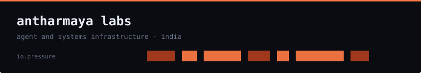
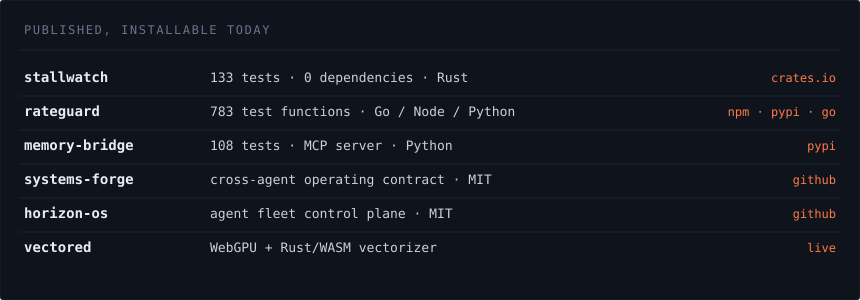

AI agents can run your systems now. almost nothing tells them where to stop.

we build that layer. an agent's budget, its memory, how it decides, what it may
touch, and the kernel-level observability underneath that says what actually
happened.

everything here is MIT or apache, installs in one line, and needs no root.
independent studio, built in india.

[antharmaya.com](https://antharmaya.com)

seven tools, one job. an agent's blast radius, and the machine underneath it.

**what it may spend** — [rateguard](https://github.com/varbees/rateguard).
token budgets, loop detection and circuit breakers, in-process. no proxy, no
network hop. go, node, python from one conformance suite.

**what it remembers** — [memory-bridge](https://github.com/antharmaya/mem-bridge).
one shared, searchable recall across every coding agent already on the machine,
served over MCP.

**how it decides** — [council-of-hats](https://github.com/antharmaya/council-of-hats).
deterministic multi-perspective review with no LLM in the decision path, so it
cannot drift.

**what it may touch** — [agent-linux-control](https://github.com/antharmaya/agent-linux-control).
native OS control through d-bus, portals and accessibility trees before ever
falling back to synthetic clicks.

**how many, and how graded** — [horizon-os](https://github.com/varbees/horizon-os).
point it at a folder of repositories and run an agent workforce across all of
them.

**whether its code survives** — [systems-forge](https://github.com/antharmaya/sys-forge).
breakers, retries, an MCP server, and a cross-agent operating contract read by
claude code, codex, cursor, cline and aider alike.

**the machine underneath** — [stallwatch](https://github.com/varbees/stallwatch).
the kernel already records what stalled. this names the systemd unit, then the
process, and whether it was the cause or the victim.

`rust` `go` `python` `typescript` `mcp` `linux` `cgroups` `psi` `systemd`
`postgres` `webgpu` `cloudflare workers`

every graphic here is generated by [`make_assets.py`](../make_assets.py) and
committed to this repo. nothing is embedded from a badge or stats service.

those services rate-limit, go down, change their rendering without telling you,
and see the traffic of everyone who visits. a studio that builds
zero-dependency infrastructure should not open its page with ten dependencies.

numbers are checked before they are written: test counts by running the suites,
versions against crates.io, npm and pypi.
