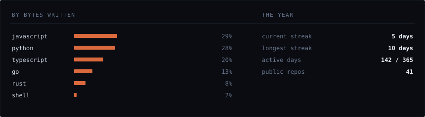

[antharmaya.com](https://antharmaya.com) · [stallwatch](https://stallwatch.antharmaya.com) · [rateguard](https://rateguard.antharmaya.com)

> AI agents can run your systems now. Almost nothing tells them where to stop.

An independent studio in India building the layer underneath: what an agent may
spend, what it remembers, how it decides, what it may touch, and the
kernel-level observability that says what actually happened.

Everything is MIT or Apache, installs in one line, and needs no root.

Seven tools, one job.

[**rateguard**](https://github.com/varbees/rateguard) · what it may spend
Token budgets, loop detection and circuit breakers, in-process. One conformance
suite, three SDKs.

[**memory-bridge**](https://github.com/antharmaya/mem-bridge) · what it remembers
One shared, searchable recall across every coding agent on the machine, over MCP.

[**council-of-hats**](https://github.com/antharmaya/council-of-hats) · how it decides
Deterministic multi-perspective review with no LLM in the decision path, so it
cannot drift.

[**agent-linux-control**](https://github.com/antharmaya/agent-linux-control) · what it may touch
Native OS control through D-Bus, portals and accessibility trees before ever
falling back to synthetic clicks.

[**horizon-os**](https://github.com/varbees/horizon-os) · how many, and how graded
Point it at a folder of repositories and run an agent workforce across all of
them.

[**systems-forge**](https://github.com/antharmaya/sys-forge) · whether its code survives
Breakers, retries, an MCP server, and a cross-agent operating contract read by
Claude Code, Codex, Cursor, Cline and Aider alike.

[**stallwatch**](https://github.com/varbees/stallwatch) · the machine underneath
The kernel already records what stalled. This names the systemd unit, then the
process, and whether it was the cause or the victim.

Every graphic here is generated, not embedded from anyone else's server.
`refresh.py` pulls the numbers from the GitHub API, `make_assets.py` draws the
SVGs, and both are committed to this repository.

Badge and stat-card services rate-limit, go down, change their rendering
without telling you, and see the traffic of everyone who visits. A studio that
ships zero-dependency infrastructure should not open its page with ten
dependencies.
